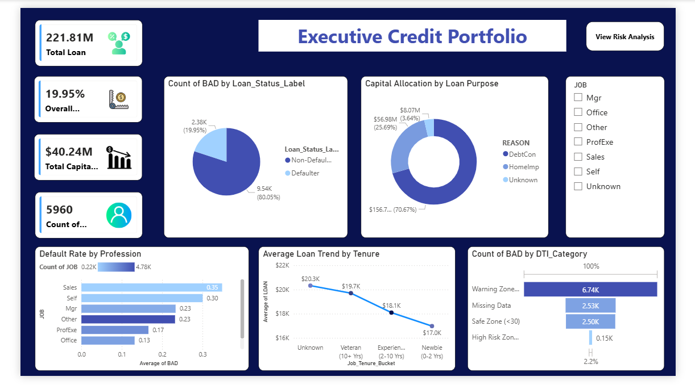

# Credit-Risk-Analysis-Dashboard
End-to-End Credit Risk Analysis using SQL and Power BI

# 📊 Credit Risk Analysis Dashboard (End-to-End)

## 🚀 Project Overview
This project analyzes **5,960 Home Equity Loan (HMEQ) applications** to identify potential defaulters. It uses a combination of **SQL** for data engineering and **Power BI** for advanced visualization.

## 🛠️ Tech Stack
* **Excel:** Initial data exploration.
* **MYSQL:** Feature engineering (LTV ratio, DTI categories, Tenure buckets).
* **Power BI:** 3-Page Interactive Dashboard with AI Root-Cause Analysis.

## 📈 Key Insights
* **Risk Density:** Borrowers with 2+ delinquent payments have an 80% higher default rate.
* **Stability:** Job tenure of 10+ years significantly reduces credit risk.
* **AI Analysis:** Using Decomposition Trees, identified 'Debt Consolidation' as a high-risk loan reason.

## 🖼️ Dashboard Preview

## 📂 Project Structure
* `/SQL_Scripts`: Contains all data transformation queries.
* `/Dashboard`: Final .pbix file.
* `/Data`: Raw dataset used for analysis.
